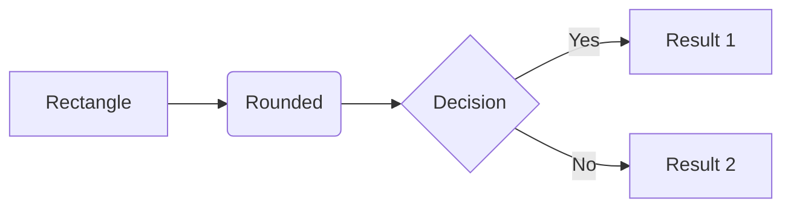
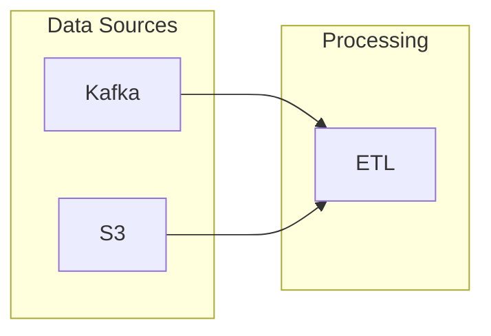
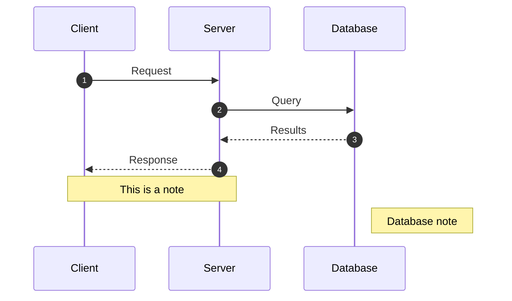
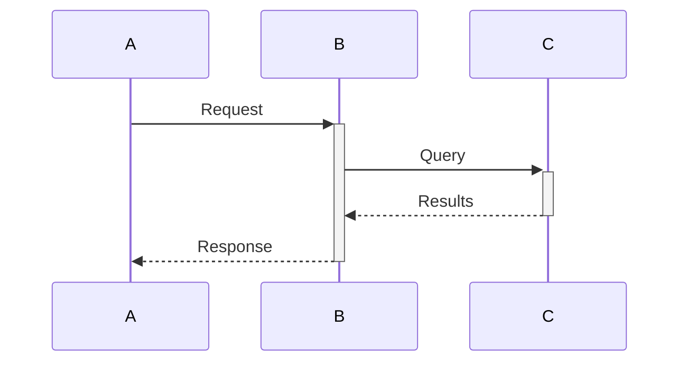
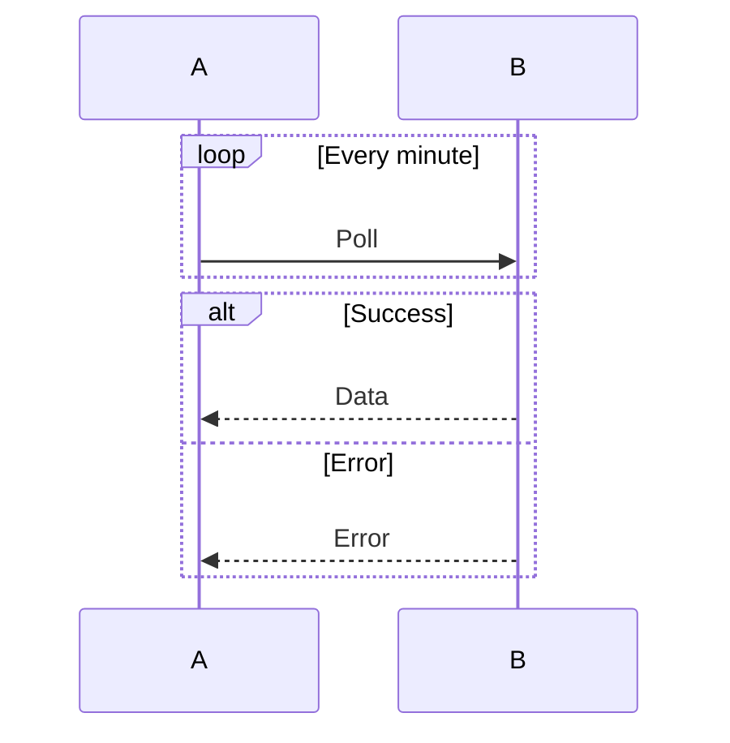
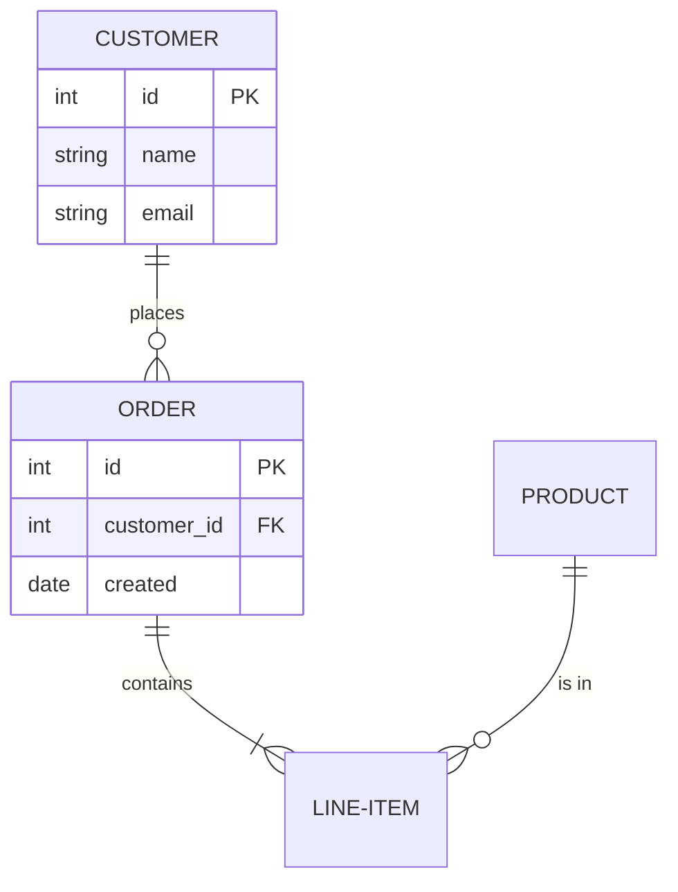
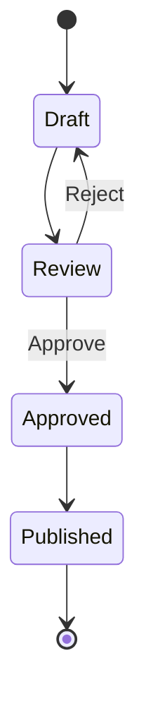
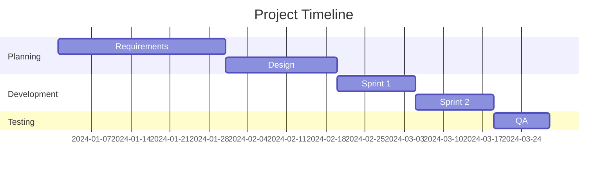
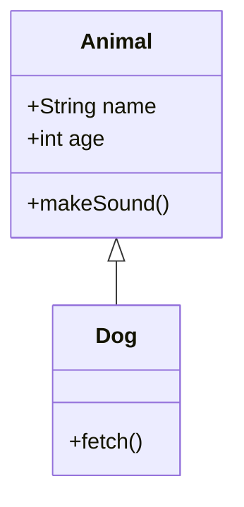
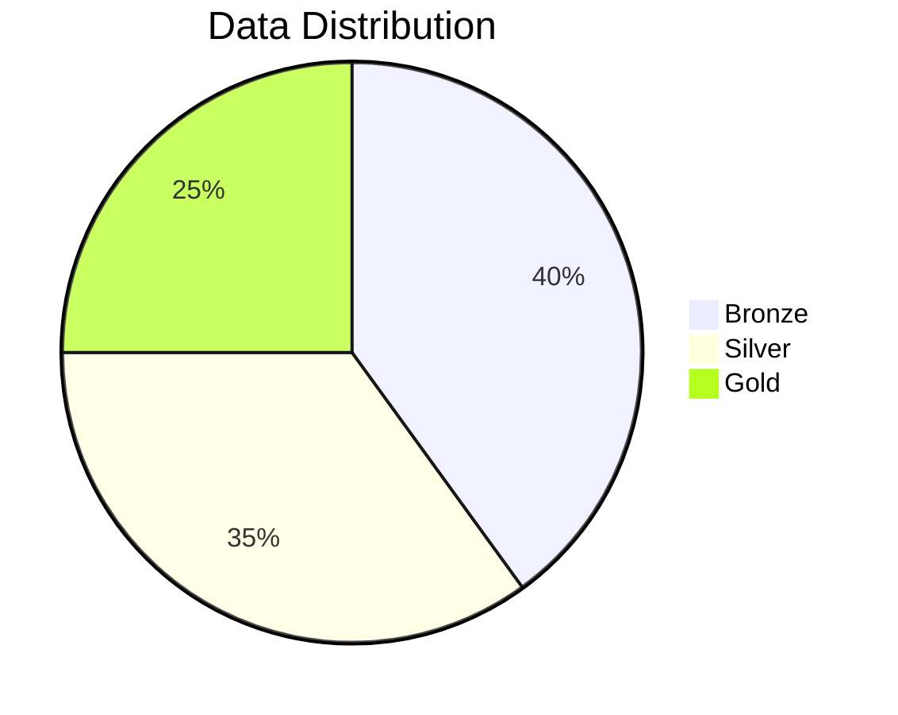

# Mermaid Syntax Quick Reference

Quick reference for creating Mermaid diagrams.

---

## Flowchart (Most Common)



### Direction
- `TB` / `TD` - Top to bottom
- `BT` - Bottom to top
- `LR` - Left to right
- `RL` - Right to left

### Node Shapes
```
A[Rectangle]
B(Rounded rectangle)
C([Stadium/pill])
D[[Subroutine]]
E[(Database)]
F((Circle))
G>Asymmetric]
H{Diamond/decision}
I{{Hexagon}}
J[/Parallelogram/]
K[\Parallelogram alt\]
L[/Trapezoid\]
M[\Trapezoid alt/]
```

### Links/Arrows
```
A --> B          Solid arrow
A --- B          Solid line (no arrow)
A -.-> B         Dotted arrow
A -.- B          Dotted line
A ==> B          Thick arrow
A === B          Thick line
A --text--> B    Arrow with text
A ---|text|B     Line with text
A -->|text| B    Arrow with text (alt)
```

### Subgraphs


---

## Sequence Diagram



### Arrow Types
```
A->B     Solid line
A-->B    Dotted line
A->>B    Solid with arrowhead
A-->>B   Dotted with arrowhead
A-xB     Solid with X
A--xB    Dotted with X
A-)B     Solid with open arrow
A--)B    Dotted with open arrow
```

### Activation


### Loops and Conditionals


---

## Entity Relationship Diagram



### Cardinality
```
||--||   One to one
||--o{   One to many
o{--o{   Many to many
||--o|   One to zero or one
```

---

## State Diagram



---

## Gantt Chart



---

## Class Diagram



---

## Pie Chart



---

## Theming


### Built-in Themes
- `default`
- `base`
- `dark`
- `forest`
- `neutral`

---

## Generating Output

### Using Mermaid CLI (mmdc)

```bash
# Install
npm install -g @mermaid-js/mermaid-cli

# Generate PNG
mmdc -i diagram.mmd -o diagram.png

# Generate SVG
mmdc -i diagram.mmd -o diagram.svg

# Generate PDF
mmdc -i diagram.mmd -o diagram.pdf

# With config
mmdc -i diagram.mmd -o diagram.png -c config.json

# With background color
mmdc -i diagram.mmd -o diagram.png -b white
```

### Config File (config.json)

```json
{
  "theme": "base",
  "themeVariables": {
    "primaryColor": "#FF3621"
  }
}
```

---

## draw.io Import

1. Open draw.io
2. File > Import From > Text
3. Select "Mermaid" format
4. Paste your .mmd content
5. Click "Insert"

The diagram will be imported as editable shapes.

---

## Live Editors

- [Mermaid Live Editor](https://mermaid.live/)
- [draw.io](https://app.diagrams.net/) (native Mermaid support)
- VS Code with Mermaid extension

---

## Tips

1. **Keep it simple**: Mermaid is best for simpler diagrams
2. **Use subgraphs**: Group related components
3. **Direction matters**: `LR` for wide, `TB` for tall
4. **Labels**: Use `|text|` for edge labels
5. **Styling**: Use `%%{init:...}%%` for theming
