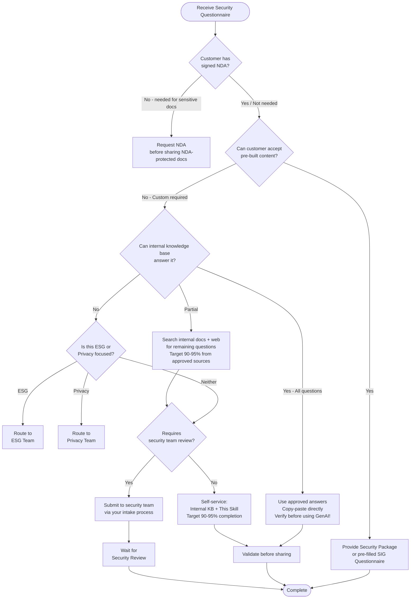

# Security Questionnaire Triage Flowchart

Use this decision tree to determine the appropriate handling path for security questionnaires.

## Critical Warnings

> **⚠️ VERIFY BEFORE SHARING:** Some security documents (SOC 2 reports, pen test summaries, Enterprise Security Guides) require a signed NDA before sharing. Confirm NDA status first.

> **⚠️ NO UNVERIFIED GenAI ANSWERS:** Do not use AI-generated content as authoritative answers. Use your internal knowledge base/approved Q&A library and copy-paste approved answers only.

> **NOTE:** Answers should be verified against your organization's specific security policies before sharing with customers.

## Decision Tree (Mermaid)

## Step-by-Step Text Version

### Step 1: NDA Verification

**Question:** Does this questionnaire or any requested document require a signed NDA?

- **YES (for NDA-protected docs like SOC 2, pen test summary)** → Confirm NDA is in place before sharing. Request NDA if not signed.
- **NO / Already signed** → Continue to Step 2

### Step 2: Attempt to Avoid Custom Questionnaire

**Question:** Can the customer accept pre-built security content instead?

- **YES** → Provide one of:
  - Security & Compliance Package (obtain from your security team)
  - Pre-filled SIG Questionnaire (obtain from your security team, if available)
  - Trust Center / public documentation

- **NO - Customer requires custom questionnaire** → Continue to Step 3

### Step 3: Internal Knowledge Base Check

**Question:** Can the questions be answered using your organization's approved Q&A library or knowledge base?

> **IMPORTANT:** Always **copy-paste** answers from approved sources. Do NOT paraphrase, summarize, or use unverified GenAI to rewrite them. Approved answers have been reviewed by security and legal experts.

- **YES - All questions covered** → Use approved answers directly (copy-paste), proceed to validation
- **PARTIAL - Some questions covered** → Use approved answers for covered questions, continue to Step 4 for remaining. **Target 90-95% from approved sources.**
- **NO - Questions not in knowledge base** → Continue to Step 4

### Step 4: ESG/Privacy Check

**Question:** Is this questionnaire focused on ESG or Privacy topics?

- **ESG (Environmental, Social, Governance)** → Route to ESG Team
  - Sustainability questions
  - Carbon footprint
  - Social responsibility
  - Corporate governance

- **Privacy** → Route to Privacy Team
  - GDPR-specific questions
  - Data subject rights
  - Privacy impact assessments
  - Cross-border data transfers

- **Neither** → Continue to Step 5

### Step 5: Security Team Review Threshold

**Question:** Does this questionnaire require security team review (based on deal size, complexity, or question scope)?

- **YES** → Submit for review via your security team's intake process
  - Security team will review and provide responses
  - Typical turnaround: 3-5 business days
  - Expedite via your security team's Slack channel or on-call contact

- **NO** → Self-service using:
  1. Your internal knowledge base for pre-answered questions (copy-paste, verify GenAI answers)
  2. Glean or Confluence search for finding approved content (search only, not chat)
  3. This skill for response formatting
  4. **Target 90-95% completion from approved sources before review**

### Step 6: Validation

Before sharing responses with the customer, use the `sqrc-validator` agent (if available) to verify:
- Answers sourced from approved documentation
- 90-95% completion target met
- Your organization vs CSP ownership correctly attributed
- No NDA content included without NDA confirmation

## Quick Reference: Routing Destinations

| Destination | When to Use | Contact Method |
|-------------|-------------|----------------|
| Internal Knowledge Base | Standard questions | Self-service (copy-paste) |
| Security Team Intake | Complex questions, large deals | Your security team's intake form/channel |
| Pre-built Content | Customer willing to accept standard docs | Request from security team |
| ESG Team | Environmental/Social/Governance | Your ESG team channel |
| Privacy Team | GDPR, data subject rights | Your Privacy team channel |
| Trust / Legal Team | Custom attestations, regulatory | Your Trust/Legal team channel |
| Security Channel | Urgent requests, clarifications | Slack or equivalent |

## Red Flags: When to Escalate

Always escalate when the questionnaire includes:

1. **Custom contractual terms** - Customer wants to modify security addendum
2. **Regulatory-specific requirements** - FedRAMP, StateRAMP, IL4/IL5, CJIS
3. **Penetration testing access requests** - Customer wants to conduct pen testing
4. **Unreleased features** - Questions about features in preview or not yet available
5. **Incident disclosure** - Asking about specific past security incidents
6. **Insurance requirements** - Cyber insurance questionnaires with coverage limits

## Red Flags: What NOT to Do

1. **⚠️ Do NOT rely solely on GenAI** - Verify AI-generated answers against authoritative documentation
2. **⚠️ Do NOT paraphrase approved answers** - Copy-paste directly from your knowledge base, don't rewrite
3. **⚠️ Do NOT write custom answers without review** - If your knowledge base doesn't have it, escalate or flag for review
4. **⚠️ Do NOT share NDA-protected docs** without confirming NDA is in place
