# Process Map Generator

Produces a **swimlane process map** following Lean Six Sigma Measure/Analyze phase standards. Maps a process across roles (swimlanes), shows decision points, handoffs, and annotates steps with Value-Added (VA), Non-Value-Added (NVA), and Necessary Non-Value-Added (NNVA) classifications.

Outputs:
1. **Mermaid flowchart** — Text-based, quick to iterate, renders in GitHub/Notion/Confluence
2. **Graphviz DOT file → Lucid Chart XML** — Visual swimlane diagram via the `lucid-diagram` skill
3. **Google Doc** — Process narrative with embedded VA/NVA analysis table and improvement opportunities

In a Databricks context, this also serves as a **data flow visualization** showing how data moves through the lakehouse architecture from source to consumer.

---

## Quick Start

User examples that trigger this skill:
```
"Create a process map for our data ingestion workflow"
"Swimlane diagram for the ML model deployment process"
"Map the current-state process for customer data onboarding"
"Process map for the ETL pipeline from this SIPOC"
"Visualize how data flows from source to Gold layer"
```

---

## Workflow

### Phase 1 — Gather Requirements

Ask the user:

| Question | Why It Matters |
|----------|---------------|
| What process are we mapping? | Scope and title |
| What are the start and end points? | Defines scope boundary (same as SIPOC) |
| Who are the roles/teams involved? | Defines swimlanes |
| What are the key steps and decisions? | Core content |
| Is this current-state or future-state? | Determines whether to annotate waste |
| What level of detail? | High-level (6–10 steps) vs. detailed (10–30 steps) |
| Are there known pain points or delays? | Seeds the waste/improvement annotations |

If a SIPOC or FMEA has been created, use the Process column from the SIPOC as the step list.

**For data platform processes**, probe for:
- Data transformation stages (Bronze/Silver/Gold)
- Orchestration and scheduling
- Data quality checkpoints
- Human review/approval gates (often NVA waste)
- Handoffs between teams (Data Eng → Analytics → Business)

---

### Phase 2 — Map the Process

#### Standard Lean Process Map Elements

| Symbol | Shape | Meaning |
|--------|-------|---------|
| **Start/End** | Oval (ellipse) | Trigger or terminal event |
| **Process Step** | Rectangle | An activity or task |
| **Decision** | Diamond | Yes/No or conditional branch |
| **Document/Output** | Parallelogram | Input or output artifact |
| **Data Store** | Cylinder | Database, table, file system |
| **Delay/Wait** | Rectangle with wave bottom | Wait state — always NVA |
| **Handoff** | Arrow crossing swimlane | Transition between roles |

#### Value Classification (Lean Standard)

Tag every process step with one of:

| Tag | Label | Definition | Color |
|-----|-------|------------|-------|
| **VA** | Value-Added | Customer would pay for this step; transforms input toward desired output | 🟢 Green |
| **NVA** | Non-Value-Added (Waste) | Customer would NOT pay; no transformation; target for elimination | 🔴 Red |
| **NNVA** | Necessary Non-Value-Added | Required but adds no direct value (e.g., compliance, approval gates) | 🟡 Yellow |

**8 Wastes — DOWNTIME (use to identify NVA):**
1. **D**efects — Bad data, wrong schema, failed quality check
2. **O**verproduction — Generating more data than consumed
3. **W**aiting — Job waiting for upstream completion; human approval bottleneck
4. **N**on-utilized talent — Engineer manually doing what automation could handle
5. **T**ransportation — Moving data between systems unnecessarily
6. **I**nventory — Staging tables never read; intermediate datasets that sit idle
7. **M**otion — Context switching; looking up documentation; finding data in catalog
8. **E**xtra-processing — Re-processing already-clean data; duplicate pipelines

---

### Phase 3 — Generate Mermaid Diagram

Generate a `flowchart TD` (top-down) or `flowchart LR` (left-right) Mermaid diagram. For swimlanes use `subgraph` blocks.

**Mermaid Template with Swimlanes:**

```mermaid
flowchart TD
    %% ── Process Map: [Process Name] ──
    %% Current State | [Date] | [Author]

    START([▶ START: Process Trigger]) --> S1

    subgraph LANE1["🏊 [Role/Team 1]"]
        direction TB
        S1[/"📥 [Input/Trigger]"/]:::nnva
        S2["⚙️ [Process Step 1]"]:::va
        S3{"🔀 [Decision Point]"}
    end

    subgraph LANE2["🏊 [Role/Team 2]"]
        direction TB
        S4["⚙️ [Process Step 2]"]:::va
        S5["⏳ Wait for approval"]:::nva
        S6["⚙️ [Process Step 3]"]:::va
        S7[("💾 [Data Store/Table]")]:::va
    end

    subgraph LANE3["🏊 [Role/Team 3]"]
        direction TB
        S8["⚙️ [Process Step 4]"]:::va
        S9["📊 [Output/Report]"]:::va
    end

    END_NODE([⏹ END: [End Condition]])

    %% ── Flow ──
    S1 --> S2
    S2 --> S3
    S3 -->|Yes| S4
    S3 -->|No| S1
    S4 --> S5
    S5 --> S6
    S6 --> S7
    S7 --> S8
    S8 --> S9
    S9 --> END_NODE

    %% ── Styling ──
    classDef va fill:#C8E6C9,stroke:#2E7D32,color:#1B5E20
    classDef nva fill:#FFCDD2,stroke:#C62828,color:#B71C1C
    classDef nnva fill:#FFF9C4,stroke:#F9A825,color:#F57F17
    classDef decision fill:#E3F2FD,stroke:#1565C0,color:#0D47A1
    classDef datastore fill:#F3E5F5,stroke:#6A1B9A,color:#4A148C
```

Save to `/tmp/process_map_[name].mmd`.

Render to image:
```bash
mmdc -i /tmp/process_map_[name].mmd -o /tmp/process_map_[name].svg
# or PNG:
mmdc -i /tmp/process_map_[name].mmd -o /tmp/process_map_[name].png
```

If `mmdc` is not available:
```bash
npm install -g @mermaid-js/mermaid-cli
```

---

### Phase 4 — Generate Lucid Chart Diagram (Swimlane DOT)

For a more polished, editable swimlane, generate a Graphviz DOT file with swimlane clusters. Use the `lucid-diagram` skill for conversion.

**DOT Swimlane Template:**

```dot
digraph ProcessMap {
    rankdir=LR;
    compound=true;
    node [fontname="Arial", fontsize=10];
    edge [color="#333333", penwidth=1.5, fontname="Arial", fontsize=9];

    // ── Graph settings ──
    graph [splines=ortho, nodesep=0.8, ranksep=1.2, pad=0.5,
           fontname="Arial", fontsize=12,
           label="[Process Name] — [Current/Future] State\n[Date]",
           labelloc=t];

    // ── Start/End ──
    START [label="START\n[Trigger]", shape=oval, style=filled, fillcolor="#E8F5E9", color="#2E7D32", penwidth=2];
    END   [label="END\n[End State]", shape=oval, style=filled, fillcolor="#E8F5E9", color="#2E7D32", penwidth=2];

    // ── Swimlane 1: [Role] ──
    subgraph cluster_lane1 {
        label="[Role/Team 1]";
        style=filled; fillcolor="#F3E5F5"; color="#7B1FA2"; fontname="Arial Bold"; fontsize=12; penwidth=2;
        rank=same;

        L1S1 [label="[Step 1]\n(VA)", shape=box, style="filled,rounded", fillcolor="#C8E6C9", color="#2E7D32"];
        L1D1 [label="[Decision]?", shape=diamond, style=filled, fillcolor="#E3F2FD", color="#1565C0"];
    }

    // ── Swimlane 2: [Role] ──
    subgraph cluster_lane2 {
        label="[Role/Team 2]";
        style=filled; fillcolor="#FFF8E1"; color="#F57F17"; fontname="Arial Bold"; fontsize=12; penwidth=2;
        rank=same;

        L2S1 [label="[Step 2]\n(VA)", shape=box, style="filled,rounded", fillcolor="#C8E6C9", color="#2E7D32"];
        L2S2 [label="Wait for\nApproval\n(NVA⚠)", shape=box, style="filled,rounded", fillcolor="#FFCDD2", color="#C62828"];
        L2DB [label="[Delta Table]", shape=cylinder, style=filled, fillcolor="#EDE7F6", color="#6A1B9A"];
    }

    // ── Swimlane 3: [Role] ──
    subgraph cluster_lane3 {
        label="[Role/Team 3]";
        style=filled; fillcolor="#E3F2FD"; color="#1565C0"; fontname="Arial Bold"; fontsize=12; penwidth=2;
        rank=same;

        L3S1 [label="[Step 3]\n(VA)", shape=box, style="filled,rounded", fillcolor="#C8E6C9", color="#2E7D32"];
        L3OUT [label="[Output]", shape=parallelogram, style=filled, fillcolor="#E8EAF6", color="#283593"];
    }

    // ── Flows ──
    START -> L1S1;
    L1S1 -> L1D1;
    L1D1 -> L2S1 [label="Yes"];
    L1D1 -> L1S1 [label="No (rework)", style=dashed, color="#C62828"];
    L2S1 -> L2S2;
    L2S2 -> L2DB;
    L2DB -> L3S1;
    L3S1 -> L3OUT;
    L3OUT -> END;
}
```



Convert to Lucid Chart XML:

```bash
# graphviz2drawio only handles box shapes — diamond, cylinder, ellipse will error
# Before converting, strip non-box shapes from the DOT file:
python3 -c "
import re, sys
content = open(sys.argv[1]).read()
for pat in [r'shape=diamond,\s*', r'shape=cylinder,\s*', r'shape=ellipse,\s*']:
    content = re.sub(pat, '', content)
open(sys.argv[2], 'w').write(content)
" /tmp/process_map_[name].dot /tmp/process_map_[name]_boxonly.dot

# Generate PNG from original (shapes preserved for visual quality)
dot -Tpng /tmp/process_map_[name].dot -o /tmp/process_map_[name].png

# Generate Lucid XML from box-only version
python3 - << 'PYEOF'
from graphviz2drawio.graphviz2drawio import convert
result = convert('/tmp/process_map_[name]_boxonly.dot')
open('/tmp/process_map_[name].xml', 'w').write(result)
print(f'XML: {len(result)} chars')
PYEOF
```

---

### Phase 5 — Generate Google Doc with Analysis

Create a process map document using the `google-docs` skill. Write markdown first, then convert:

```bash
cat > /tmp/process_map_doc.md << 'EOF'
# Process Map: [Process Name]

**Date:** [Date]
**Author:** [Author]
**State:** Current State / Future State
**Scope:** [Start trigger] → [End condition]

---

## Process Overview

[2–3 sentence description of what this process does and why it matters]

---

## Swimlane Summary

| Role / Team | Responsibilities in this Process |
|-------------|----------------------------------|
| [Team 1] | [What they do] |
| [Team 2] | [What they do] |
| [Team 3] | [What they do] |

---

## Step-by-Step Narrative

### 1. [Step Name] — [VA/NVA/NNVA]
**Owner:** [Team]
**Description:** [What happens]
**Inputs:** [What is needed]
**Outputs:** [What is produced]
**Time (typical):** [Duration]

[Repeat for each step]

---

## Value Analysis

| Step | Classification | Waste Category (if NVA) | Improvement Opportunity |
|------|---------------|------------------------|-------------------------|
| [Step 1] | VA | — | — |
| [Step 2] | NVA | Waiting | Automate approval via Databricks Workflows |
| [Step 3] | NNVA | — | Streamline compliance check |

**Summary:**
- Value-Added (VA): N steps ([X]% of total time)
- Necessary Non-Value-Added (NNVA): N steps ([Y]% of total time)
- Non-Value-Added (NVA): N steps ([Z]% of total time — target for elimination)

---

## Identified Waste (DOWNTIME)

| Waste Type | Where Observed | Impact | Recommended Improvement |
|------------|---------------|--------|------------------------|
| Waiting | [Step X] — approval gate | +[N] hours per cycle | Automate trigger in Databricks Workflows |
| Defects | [Step Y] — bad data | Reprocessing required | Add DLT expectations with quarantine |
| Motion | [Step Z] — data discovery | Engineer time wasted | Add Unity Catalog descriptions and tags |

---

## Improvement Opportunities

1. **[Highest priority]**: [Description] — Potential impact: [time/cost/quality saved]
2. **[Second priority]**: [Description] — Potential impact: [time/cost/quality saved]
3. **[Third priority]**: [Description] — Potential impact: [time/cost/quality saved]

---

## Metrics to Track

| Metric | Current State | Target | How to Measure |
|--------|--------------|--------|----------------|
| End-to-end cycle time | [N hrs] | [Target] | Databricks job run timeline |
| % VA time | [N%] | >60% | Time study |
| Error/defect rate | [N%] | <1% | DLT expectation failure rate |
| Handoff count | [N] | [Target] | Process steps crossing swimlane boundaries |

---

## Next Steps

- [ ] Run FMEA on high-risk steps (use `/lean-sigma-fmea`)
- [ ] Prioritize top 3 improvement opportunities for next sprint
- [ ] Schedule Kaizen event for quick wins
- [ ] Define future-state process map target

EOF

python3 ~/.claude/plugins/cache/claude-vibe/google-tools/*/skills/google-docs/resources/markdown_to_gdocs.py \
  --input /tmp/process_map_doc.md \
  --title "Process Map — [Process Name] — [Customer] — [Date]"
```

---

### Phase 6 — Deliver Outputs

Present to the user:

1. **Mermaid diagram** — Render inline if possible, or provide the `.mmd` source
2. **Lucid Chart import file** (`.xml`) with instructions:
   - Open Lucidchart → File → Import → select the `.xml` file
   - Each swimlane is color-coded: Green (VA), Red (NVA), Yellow (NNVA)
3. **Google Doc URL**
4. **Key insights summary**:
   ```
   ## Process Map Analysis Summary

   📊 Process: [Name]
   🏊 Swimlanes: [N roles]
   📍 Steps: [N total] ([N VA | N NNVA | N NVA])
   ⚠️  Waste identified: [N NVA steps = X% of process]

   Top improvement opportunities:
   1. [Opportunity] — eliminates [N hrs/week] of waste
   2. [Opportunity]
   3. [Opportunity]

   ➡️ Suggested next: Run /lean-sigma-fmea on the high-risk steps
   ```

---

## DMAIC Phase Guidance

This skill is used in the **Measure** and **Analyze** phases:

| DMAIC Phase | How to Use This Map |
|-------------|---------------------|
| **Measure** | Current-state map documents the as-is process; collect cycle time data per step |
| **Analyze** | Identify root causes of waste; use 5 Whys at each NVA step |
| **Improve** | Design future-state map eliminating NVA steps; reduce NNVA steps |
| **Control** | Use map as SOPs; update when process changes; monitor metrics in Databricks system tables |

---

## Resources

- `resources/lean_symbols_guide.md` — Standard Lean/BPMN symbol reference and DOT patterns

---

## Do NOT

- Include more than 3–4 swimlanes (diagram becomes unreadable)
- Map implementation details (e.g., specific Python library calls) at the process map level
- Label every step VA — be honest about NNVA and NVA; they are improvement opportunities
- Create the future-state map before the current-state map — you must understand the current process first
- Use generic role names ("Team A") — use actual role names for specificity
