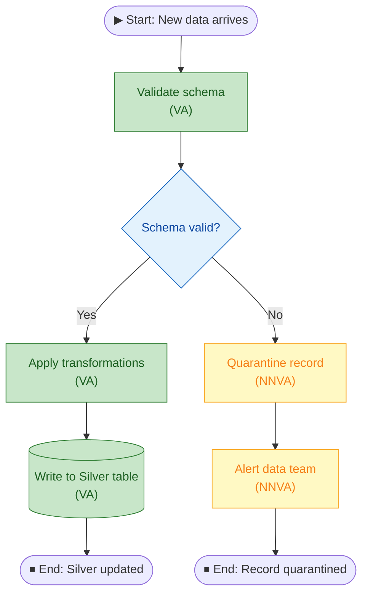
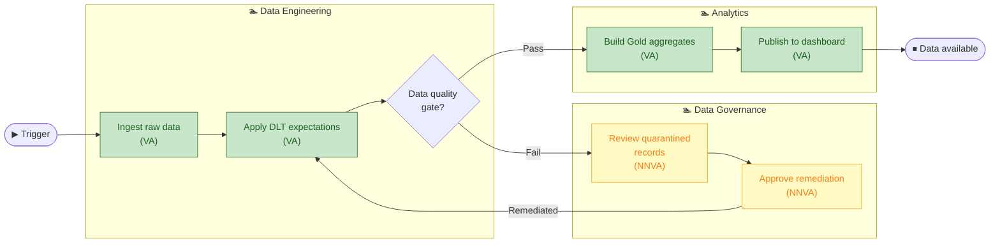
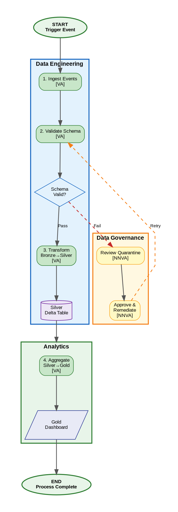
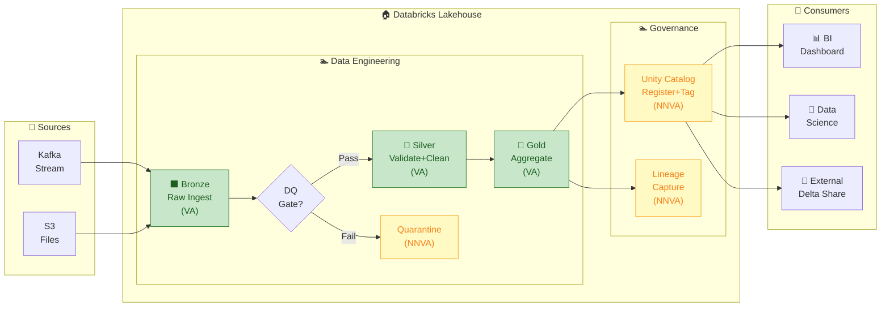
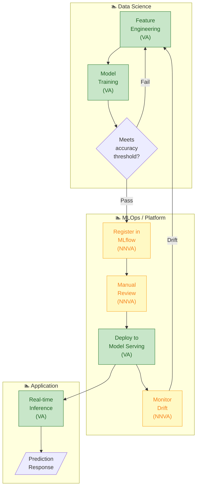
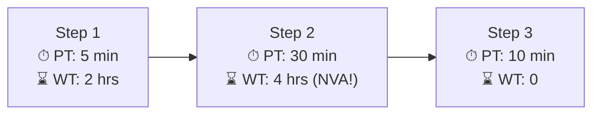

# Lean Process Map Symbols & Patterns Reference

Standard symbols used in Lean Six Sigma process maps, with Mermaid syntax and Graphviz DOT equivalents for generating diagrams programmatically.

---

## Standard Symbols

| Symbol | Name | Mermaid Syntax | DOT Shape | When to Use |
|--------|------|---------------|-----------|-------------|
| Oval | Start / End | `([Text])` | `shape=oval` | Process start trigger, terminal state |
| Rectangle | Process Step | `[Text]` | `shape=box` | Any activity or task |
| Diamond | Decision | `{Text}` | `shape=diamond` | Yes/No branch, conditional logic |
| Parallelogram | Input/Output | `/[Text]/` | `shape=parallelogram` | Document, data, or artifact |
| Cylinder | Data Store | `[(Text)]` | `shape=cylinder` | Database, Delta table, file system |
| Rounded Rectangle | External Entity | — | `shape=box, style=rounded` | Customer, external system, partner |
| Wave-bottom Rectangle | Delay/Wait | `[⏳ Wait]` | `shape=box` with NVA color | Waiting state — always NVA |
| Arrow → | Flow | `-->` | `->` | Sequential flow |
| Dashed Arrow | Optional/Rework | `-.->` | `[style=dashed]` | Rework loop, exception path |
| Bold Arrow | Critical Path | `==>` | `[penwidth=3]` | Main happy path |

---

## Value Classification Colors

| Classification | Hex Color | Meaning |
|----------------|-----------|---------|
| VA (Value-Added) | `#C8E6C9` / `#2E7D32` | Customer pays for this; keep and optimize |
| NVA (Waste) | `#FFCDD2` / `#C62828` | Eliminate; target for kaizen |
| NNVA (Necessary Non-VA) | `#FFF9C4` / `#F9A825` | Minimize; automate where possible |
| Decision | `#E3F2FD` / `#1565C0` | Conditional branch |
| Data Store | `#EDE7F6` / `#6A1B9A` | Storage artifact |
| Start/End | `#E8F5E9` / `#2E7D32` | Process boundary |

---

## Swimlane Color Palette

Assign one background color per swimlane (role/team):

| Role Type | Suggested Color | Hex |
|-----------|----------------|-----|
| Data Engineering | Light blue | `#E3F2FD` |
| Data Science / ML | Light purple | `#F3E5F5` |
| Data Governance / Ops | Light amber | `#FFF8E1` |
| Business / Analyst | Light green | `#E8F5E9` |
| External / Customer | Light red | `#FFEBEE` |
| Platform / Infrastructure | Light gray | `#ECEFF1` |
| Security / Compliance | Light orange | `#FBE9E7` |

---

## Mermaid Patterns

### Basic Process Flow (no swimlanes)

### Swimlane Flow (subgraph pattern)

---

## Graphviz DOT Patterns

### Complete Swimlane Template

---

## Common Databricks Process Patterns

### Bronze → Silver → Gold Pipeline

### ML Pipeline (Training → Serving)

---

## Cycle Time Annotation

Add cycle time data to each step for Value Stream Mapping:

`PT` = Process Time (actual work)
`WT` = Wait Time (idle, queuing — often NVA)

**Process Efficiency = Total PT / (Total PT + Total WT)**
- Target: > 60% for a lean process
- Typical: 5–20% in non-optimized processes (80%+ is waste)
