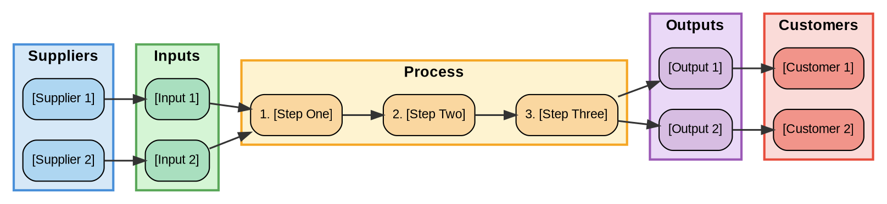

# SIPOC Generator

Produces a **SIPOC (Suppliers → Inputs → Process → Outputs → Customers)** artifact using the DMAIC Define-phase standard. Outputs a Google Sheet (structured, shareable) and optionally a Lucid Chart visual diagram.

SIPOC is the **starting point** of any Lean Six Sigma engagement. It provides the 30,000-foot view before diving into detailed process maps or FMEA risk assessments. In a Databricks context it also serves as a **business architecture decomposition** tool: The Firm = { Suppliers × Inputs × Processes × Outputs × Customers }.

---

## Quick Start

User examples that trigger this skill:
```
"Create a SIPOC for Acme's data ingestion process"
"Build a SIPOC diagram for our Unity Catalog migration project"
"Map out the SIPOC for this customer's ML pipeline"
"SIPOC for the real-time streaming use case at Block"
```

---

## Workflow

### Phase 1 — Gather Context

Ask the user for the following (or infer from conversation/Salesforce context):

| Field | Description | Example |
|-------|-------------|---------|
| **Process name** | Short, action-oriented title | "Customer 360 Data Pipeline" |
| **Process scope** | Start trigger + end condition | "Starts: source system event / Ends: Gold table written" |
| **Customer/account** | For FE engagements | "Acme Corp" |
| **Primary stakeholders** | Who to involve | "Data Engineering, Analytics team" |
| **Domain** | Data domain or use case | "Real-time analytics", "ML feature store", "Regulatory reporting" |

If a Salesforce account is referenced, use the salesforce skill to pull account context (industry, use cases, platform).

If the user provides a Google Doc, Slack thread, or prior notes, read them first for context.

### Phase 2 — Build SIPOC Content (Standard Order: P → O → C → I → S)

Follow this order — it is the standard best practice to prevent scope creep:

#### Step 1: Define the Process (P) — 4–7 steps maximum
Each step should be: **[Action verb] + [Subject]**
Examples: "Ingest raw events", "Validate schema", "Apply transformations", "Publish to Gold layer"

Keep it at the business/capability level. Avoid implementation details (no "run Python notebook").

#### Step 2: Identify Outputs (O)
For each process step, what is produced? Types:
- Data products (Delta tables, datasets, API endpoints)
- Reports/dashboards
- Models, embeddings, predictions
- Notifications, triggers, SLAs met

#### Step 3: Identify Customers (C)
Who consumes the outputs? May be internal or external:
- Internal: Data scientists, analysts, ML engineers, executives
- External: Partners, regulatory bodies, end users, downstream systems

Use the **COPIS approach** — design from the customer backward to ensure customer-centricity.

#### Step 4: Identify Inputs (I)
What does each process step need to function?
- Raw data feeds, events, files
- Configuration, business rules, metadata
- Credentials, tokens, schemas
- Human approvals, triggers

#### Step 5: Identify Suppliers (S)
Who or what provides the inputs?
- Internal: other teams, systems, databases
- External: SaaS vendors, APIs, partners, IoT devices, CDPs

---

### Phase 3 — Databricks WA Framework Alignment

For each **Process step**, tag the relevant Well-Architected pillar(s). This elevates SIPOC from a process tool into a **strategic architecture planning tool**.

| WA Pillar | What to Flag |
|-----------|-------------|
| **Data & AI Governance** | Lineage tracking, Unity Catalog registration, access controls, PII handling |
| **Reliability** | SLA requirements, failure handling, retry logic, data quality gates |
| **Security** | Auth mechanisms, encryption, network paths, compliance requirements |
| **Performance Efficiency** | Latency targets, throughput, compute sizing, caching strategy |
| **Cost Optimization** | Storage tiers, compute right-sizing, egress costs, idle resources |
| **Operational Excellence** | Observability, CI/CD, runbooks, alerting, on-call ownership |
| **Interoperability & Usability** | API standards, format choices, tool accessibility, discovery |

Add a **"WA Pillar Tags"** column to the Process section of the SIPOC.

---

### Phase 4 — Create Google Sheet

Use the `google-sheets` skill. Authenticate first:

```bash
TOKEN=$(python3 ~/.claude/plugins/cache/fe-vibe/fe-google-tools/*/skills/google-auth/resources/google_auth.py token)
```

Create a spreadsheet with **two sheets**:

**Sheet 1: "SIPOC"** — Main artifact (5 columns + WA tags)

| Column | Width | Color Header |
|--------|-------|--------------|
| Suppliers | ~200px | `#4A90D9` (blue) |
| Inputs | ~200px | `#5BA85A` (green) |
| Process Step | ~250px | `#F5A623` (orange) |
| Outputs | ~200px | `#9B59B6` (purple) |
| Customers | ~200px | `#E74C3C` (red) |
| WA Pillar Tags | ~180px | `#7F8C8D` (gray) |

Formatting rules:
- Row 1: Bold headers, dark navy background (`#1A3A5C`), white text
- Process steps: Left-aligned, numbered (1. 2. 3. ...)
- Freeze row 1, add borders, wrap text, set row height to 110px

**Sheet 2: "SIPOC Deep Dive"** — Databricks-specific detail per element

For each Supplier, Input, Process Step, Output, and Customer, populate the detail fields from `resources/databricks_sipoc_guide.md`.

#### API patterns (tested and working):

```bash
# 1. Create spreadsheet
SPREADSHEET=$(curl -s -X POST \
  "https://sheets.googleapis.com/v4/spreadsheets" \
  -H "Authorization: Bearer $TOKEN" \
  -H "x-goog-user-project: ${GCP_QUOTA_PROJECT}" \
  -H "Content-Type: application/json" \
  -d '{
    "properties": {"title": "SIPOC - [Process Name] - [Customer]"},
    "sheets": [
      {"properties": {"title": "SIPOC", "index": 0}},
      {"properties": {"title": "SIPOC Deep Dive", "index": 1}}
    ]
  }')
SHEET_ID=$(echo $SPREADSHEET | python3 -c "import sys,json; print(json.load(sys.stdin)['spreadsheetId'])")

# Get individual sheet tab IDs (needed for formatting calls)
SHEETS_META=$(curl -s "https://sheets.googleapis.com/v4/spreadsheets/${SHEET_ID}?fields=sheets.properties" \
  -H "Authorization: Bearer $TOKEN" -H "x-goog-user-project: ${GCP_QUOTA_PROJECT}")
SIPOC_TAB_ID=$(echo $SHEETS_META | python3 -c "
import sys,json; sheets=json.load(sys.stdin)['sheets']
print([s['properties']['sheetId'] for s in sheets if s['properties']['title']=='SIPOC'][0])")
DEEPDIVE_TAB_ID=$(echo $SHEETS_META | python3 -c "
import sys,json; sheets=json.load(sys.stdin)['sheets']
print([s['properties']['sheetId'] for s in sheets if s['properties']['title']=='SIPOC Deep Dive'][0])")

# 2. IMPORTANT: Expand secondary sheet rows before writing.
#    New sheets default to a small row count and writes will fail with a range error.
curl -s -X POST "https://sheets.googleapis.com/v4/spreadsheets/${SHEET_ID}:batchUpdate" \
  -H "Authorization: Bearer $TOKEN" -H "x-goog-user-project: ${GCP_QUOTA_PROJECT}" \
  -H "Content-Type: application/json" \
  -d "{\"requests\": [{\"appendDimension\": {\"sheetId\": $DEEPDIVE_TAB_ID, \"dimension\": \"ROWS\", \"length\": 50}}]}"

# 3. Freeze header row — use updateSheetProperties, NOT a standalone "frozenRowCount" key
curl -s -X POST "https://sheets.googleapis.com/v4/spreadsheets/${SHEET_ID}:batchUpdate" \
  -H "Authorization: Bearer $TOKEN" -H "x-goog-user-project: ${GCP_QUOTA_PROJECT}" \
  -H "Content-Type: application/json" \
  -d "{\"requests\": [{
    \"updateSheetProperties\": {
      \"properties\": {\"sheetId\": $SIPOC_TAB_ID, \"gridProperties\": {\"frozenRowCount\": 1}},
      \"fields\": \"gridProperties.frozenRowCount\"
    }
  }]}"
```

---

### Phase 5 — Create Lucid Chart Diagram (Optional but Recommended)

Generate a visual SIPOC using the `lucid-diagram` skill. Produce a Graphviz DOT file that models the SIPOC as a horizontal flow.

Write the DOT file to `/tmp/sipoc_[process_name].dot`:



Convert to PNG and Lucid Chart XML:

```bash
# Primary: use the lucid-diagram conversion script
python3 ~/.claude/plugins/cache/fe-vibe/fe-specialized-agents/*/skills/lucid-diagram/scripts/convert_to_lucid.py \
  /tmp/sipoc_[process_name].dot /tmp/sipoc_[process_name].xml
```

If that fails with "graphviz2drawio not found" (Python path mismatch), use this fallback:

```bash
# Install if missing
pip3 install graphviz2drawio -q

# Generate PNG directly with graphviz
dot -Tpng /tmp/sipoc_[process_name].dot -o /tmp/sipoc_[process_name].png

# Generate Lucid Chart XML via Python
python3 -c "
from graphviz2drawio.graphviz2drawio import convert
result = convert('/tmp/sipoc_[process_name].dot')
open('/tmp/sipoc_[process_name].xml', 'w').write(result)
print('XML generated')
"
```

This produces `/tmp/sipoc_[process_name].png` and `/tmp/sipoc_[process_name].xml`.

**Note:** Graphviz warns that orthogonal (`splines=ortho`) edges don't support labels — use `xlabel` attributes or switch to `splines=polyline` if edge labels are needed.

---

### Phase 6 — Deliver Outputs

Present to the user:

1. **Google Sheet URL** — "Here is your SIPOC: [link]"
2. **Lucid Chart import instructions** (if diagram generated):
   - Open Lucidchart → File → Import → select the `.xml` file
3. **Key observations** — Summarize 3–5 insights from the SIPOC:
   - Identified risks (e.g., single supplier dependency)
   - WA gaps (e.g., no observability step in process)
   - Recommendations for FMEA (which process steps have highest risk)
   - Suggested next step: "Run `/lean-sigma-fmea` to assess failure risks in these process steps"

---

## SIPOC → FMEA Handoff

After completing the SIPOC, offer to run a FMEA:

> "Your SIPOC identified [N] process steps. Would you like me to run a FMEA to identify and prioritize failure risks? Use `/lean-sigma-fmea` or just say 'run a FMEA on this SIPOC'."

Pass the process steps directly to the FMEA skill.

---

## Resources

- `resources/databricks_sipoc_guide.md` — Databricks-specific detail questions per SIPOC element
- `resources/wa_alignment.md` — Well-Architected pillar alignment reference

---

## Do NOT

- Create more than 7 process steps (loses the "high-level view" purpose)
- Include implementation-level detail in the Process column (no specific tools, languages, or configs)
- Skip the WA alignment — it is what differentiates this SIPOC from a generic one
- Guess supplier/customer names — confirm with the user
- Use "The customer" — always use the actual company or persona name
