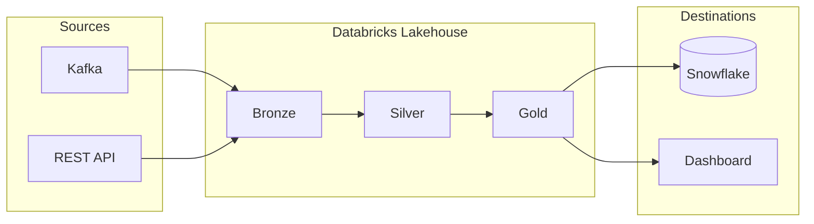

# Architecture Diagram Generator

Generate professional, beautifully-spaced architecture diagrams with vendor icons and visual feedback-driven refinement.

## Capabilities

- **Vendor Icons**: Native AWS, GCP, Azure, Kubernetes, plus bundled Databricks/Snowflake/Kafka icons
- **Two Engines**: mingrammer/diagrams (Python) for icon-heavy diagrams, Mermaid for simple flowcharts
- **Visual Feedback Loop**: Render → view in Chrome DevTools → critique spacing → refine
- **Multiple Outputs**: PNG, SVG, DOT (Graphviz), MMD (Mermaid) for draw.io import

## When to Use Each Engine

| Use Case | Engine | Reason |
|----------|--------|--------|
| Vendor-icon-heavy diagrams | diagrams (Python) | Native AWS/GCP/K8s icons, Graphviz layout |
| Simple flowcharts, sequences | Mermaid | Simpler syntax, draw.io import |
| Current/future state comparisons | diagrams | Better visual consistency |
| Quick sketches | Mermaid | Faster iteration |

---

## Prerequisites

The skill will automatically set up dependencies on first use:

1. **Graphviz** (for diagrams engine): `brew install graphviz`
2. **Python diagrams package**: Installed in isolated `~/.vibe/diagrams/` environment via uv
3. **Mermaid CLI** (optional, for Mermaid engine): `npm install -g @mermaid-js/mermaid-cli`

Run the setup script to install all dependencies:
```bash
bash "${CLAUDE_PLUGIN_ROOT}/skills/architecture-diagram/resources/scripts/setup_diagrams_env.sh"
```

---

## Workflow

### Step 1: Understand Requirements

Ask the user:
1. **What architecture are you diagramming?** (data pipeline, microservices, lakehouse, etc.)
2. **What vendors/technologies?** (Databricks, AWS, Snowflake, Kafka, etc.)
3. **Current state, future state, or both?**
4. **Output format preference?** (PNG for docs, SVG for web, source for editing)

### Step 2: Choose Template or Create Custom

Review available templates in `${CLAUDE_PLUGIN_ROOT}/skills/architecture-diagram/resources/templates/`

**diagrams templates** (Python):
- `data_pipeline.py` - Kafka → Bronze → Silver → Gold → Snowflake
- `lakehouse.py` - Full Databricks lakehouse with Unity Catalog
- `multi_cloud.py` - AWS + GCP + Azure integration
- `streaming.py` - Real-time streaming architecture
- `genai_agent.py` - RAG + Agent Framework + MLflow Tracing
- `ai_bi.py` - Genie Rooms + Lakeview Dashboards
- `aws_lakehouse.py` - Databricks on AWS with native AWS services
- `azure_lakehouse.py` - Databricks on Azure with native Azure services
- `gcp_lakehouse.py` - Databricks on GCP with native GCP services

**Mermaid templates**:
- `data_pipeline.mmd` - Simple ETL flow
- `microservices.mmd` - Service mesh diagram
- `sequence.mmd` - API call sequence

### Step 3: Generate Initial Diagram

**For diagrams engine (Python):**

```bash
# Ensure environment is set up
~/.vibe/diagrams/.venv/bin/python --version

# Run diagram script
cd /path/to/output
~/.vibe/diagrams/.venv/bin/python diagram.py
```

**For Mermaid engine:**

```bash
# Generate SVG
mmdc -i diagram.mmd -o diagram.svg

# Generate PNG
mmdc -i diagram.mmd -o diagram.png
```

### Step 4: Visual Feedback Loop (CRITICAL)

Use Chrome DevTools MCP to view and critique the diagram:

```python
# 1. Open the generated image in browser
mcp__chrome-devtools__new_page(url="file:///path/to/diagram.png")

# 2. Take screenshot for analysis
mcp__chrome-devtools__take_screenshot()

# 3. Analyze and critique:
# - Are components evenly spaced?
# - Do arrows overlap or cross unnecessarily?
# - Is visual hierarchy clear?
# - Are related items properly grouped?
# - Is text readable at expected size?

# 4. Refine the code based on critique
# - Adjust graph_attr for spacing
# - Reorder components to reduce arrow crossings
# - Add/adjust clusters for grouping

# 5. Regenerate and repeat until satisfied
```

### Step 5: Validate Architecture Recommendations

Before finalizing the diagram, validate that the architecture makes sense:

**1. Verify product capabilities with Glean (if available):**
```python
# Search Glean for product documentation
mcp__glean__glean_read_api_call("search.query", {
    "query": "Delta Live Tables streaming ingestion from Kafka",
    "page_size": 5
})
```

**2. Research uncertain recommendations:**
If unsure about a product's capabilities or best practices, invoke the `/product-question-research` skill in parallel:
- "Does Delta Live Tables support direct Kafka ingestion?"
- "Can Unity Catalog govern external Iceberg tables?"
- "What's the recommended pattern for Snowflake to Databricks data sharing?"

**3. Validate against known patterns:**
- Check `references/databricks_products.md` for where each product fits
- Verify competitive positioning (e.g., don't show Databricks SQL feeding into Snowflake for analytics - that's backwards)
- Ensure data flow direction makes sense (sources → ingestion → processing → serving)

**4. Common validation checks:**
- [ ] Are all connections technically possible? (e.g., Auto Loader supports the source format)
- [ ] Is the product placement correct? (e.g., Unity Catalog governs, doesn't process)
- [ ] Are competing products shown appropriately? (migration vs coexistence)
- [ ] Does the architecture match customer's cloud provider?

**5. If uncertain, ask:**
Use Glean to search internal docs or Slack for similar customer architectures:
```python
mcp__glean__glean_read_api_call("search.query", {
    "query": "architecture diagram Kafka Databricks lakehouse",
    "datasource": "slack"
})
```

### Step 6: Export Final Formats

Provide the user with:
- **PNG**: For documentation, presentations
- **SVG**: For web, scalable viewing
- **Source file**: `.py` or `.mmd` for future editing
- **DOT file** (diagrams): For Graphviz or draw.io import

---

## Quick Customization

Templates are easy to customize. Common swaps:

### Streaming Sources
```python
# Kinesis → MSK (Kafka)
# Before:
from diagrams.aws.analytics import Kinesis
kinesis = Kinesis("Kinesis")

# After:
from diagrams.onprem.queue import Kafka
msk = Kafka("MSK (Kafka)")
```

### Common Swaps Reference

| Component | AWS | Azure | GCP | Self-hosted |
|-----------|-----|-------|-----|-------------|
| Streaming | `Kinesis` | `EventHubs` | `PubSub` | `Kafka` |
| Database | `RDS`, `Aurora` | `SQLDatabase` | `SQL` | `PostgreSQL`, `MySQL` |
| Warehouse | `Redshift` | `SynapseAnalytics` | `BigQuery` | - |
| Orchestration | `StepFunctions` | `DataFactory` | `Composer` | `Airflow` |

See `references/customization_guide.md` for complete swap tables and examples.

---

## Vendor Icon Reference

The mingrammer/diagrams library includes **300+ built-in icons** - you only need custom icons for Databricks-specific products and a few services not in the library (like Snowflake).

### Built-in Icons (mingrammer/diagrams) - 300+ Available

**AWS** (`from diagrams.aws.*`):
- compute: EC2, Lambda, ECS, EKS, Fargate
- database: RDS, DynamoDB, Redshift, Aurora
- storage: S3, EFS, FSx
- analytics: Glue, Athena, EMR, Kinesis, QuickSight
- integration: SQS, SNS, EventBridge, StepFunctions
- network: VPC, CloudFront, Route53, ELB

**GCP** (`from diagrams.gcp.*`):
- compute: GCE, GKE, CloudFunctions, CloudRun
- database: BigQuery, Spanner, CloudSQL, Firestore
- storage: GCS
- analytics: Dataflow, Dataproc, Pub/Sub, Composer

**Azure** (`from diagrams.azure.*`):
- compute: VirtualMachines, AKS, Functions
- database: SQLDatabase, CosmosDB, Synapse
- storage: BlobStorage, DataLake
- analytics: Databricks (native!), DataFactory, EventHubs

**Kubernetes** (`from diagrams.k8s.*`):
- compute: Pod, Deployment, StatefulSet, DaemonSet
- network: Service, Ingress
- storage: PV, PVC, StorageClass

**On-Premises** (`from diagrams.onprem.*`):
- queue: Kafka, RabbitMQ
- analytics: Spark, Flink, Presto, Trino
- workflow: Airflow, NiFi
- database: PostgreSQL, MySQL, MongoDB, Cassandra

### Bundled Custom Icons

Located in `${CLAUDE_PLUGIN_ROOT}/skills/architecture-diagram/resources/icons/`

**Databricks** (`icons/databricks/`):
- `workspace.png` - Databricks workspace
- `unity_catalog.png` - Unity Catalog
- `delta_lake.png` - Delta Lake
- `lakehouse.png` - Lakehouse medallion
- `sql_warehouse.png` - SQL Warehouse
- `model_serving.png` - Model Serving endpoint

**Cloud Services** (`icons/cloud/`):
- `snowflake.png` - Snowflake
- `kafka.png` - Apache Kafka (alternative)
- `confluent.png` - Confluent Cloud
- `airflow.png` - Apache Airflow (alternative)

Use custom icons with:
```python
from diagrams.custom import Custom

ICONS = "${CLAUDE_PLUGIN_ROOT}/skills/architecture-diagram/resources/icons"
databricks = Custom("Databricks", f"{ICONS}/databricks/workspace.png")
```

---

## Spacing Controls (Graphviz)

Fine-tune diagram layout with graph attributes:

```python
with Diagram("Architecture",
             show=False,
             filename="output",
             outformat="png",
             graph_attr={
                 "splines": "ortho",      # 90-degree arrows (or "polyline", "curved")
                 "nodesep": "1.0",        # Horizontal spacing between nodes
                 "ranksep": "1.5",        # Vertical spacing between ranks
                 "pad": "0.5",            # Padding around the diagram
                 "fontsize": "14",        # Default font size
                 "bgcolor": "white",      # Background color
                 "dpi": "150"             # Resolution
             },
             node_attr={
                 "fontsize": "12"         # Node label font size
             },
             edge_attr={
                 "fontsize": "10"         # Edge label font size
             }):
```

### Common Layout Fixes

| Problem | Solution |
|---------|----------|
| Nodes too close | Increase `nodesep` (horizontal) or `ranksep` (vertical) |
| Arrows overlapping | Try `splines="ortho"` or `splines="polyline"` |
| Diagram too cramped | Increase `pad` |
| Text too small | Increase `fontsize` |
| Arrows crossing | Reorder nodes in code, or use `direction="LR"` |

---

## Example: Complete Data Pipeline

```python
from diagrams import Diagram, Cluster, Edge
from diagrams.onprem.queue import Kafka
from diagrams.aws.storage import S3
from diagrams.custom import Custom
import os

# Icon paths
ICONS = os.path.expanduser("~/.claude/plugins/cache/claude-vibe/workflows/*/skills/architecture-diagram/resources/icons")

with Diagram("Data Lakehouse Pipeline",
             show=False,
             filename="lakehouse_pipeline",
             outformat="png",
             direction="LR",
             graph_attr={
                 "splines": "ortho",
                 "nodesep": "1.0",
                 "ranksep": "2.0",
                 "pad": "0.5",
                 "fontsize": "14",
                 "bgcolor": "white"
             }):

    # Sources
    with Cluster("Data Sources"):
        kafka = Kafka("Kafka\nStreams")
        s3_raw = S3("S3 Raw\nFiles")

    # Lakehouse
    with Cluster("Databricks Lakehouse"):
        with Cluster("Bronze"):
            bronze = Custom("Raw\nIngestion", f"{ICONS}/databricks/delta_lake.png")

        with Cluster("Silver"):
            silver = Custom("Cleaned\nValidated", f"{ICONS}/databricks/delta_lake.png")

        with Cluster("Gold"):
            gold = Custom("Business\nAggregates", f"{ICONS}/databricks/delta_lake.png")

    # Destinations
    with Cluster("Consumption"):
        snowflake = Custom("Snowflake\nAnalytics", f"{ICONS}/cloud/snowflake.png")
        dashboard = Custom("BI\nDashboards", f"{ICONS}/databricks/sql_warehouse.png")

    # Data flow
    kafka >> bronze
    s3_raw >> bronze
    bronze >> silver >> gold
    gold >> snowflake
    gold >> dashboard
```

---

## Mermaid Quick Reference

For simple diagrams, Mermaid is faster:



Generate with:
```bash
mmdc -i diagram.mmd -o diagram.svg
```

Import to draw.io: File > Import From > Text > Mermaid

---

## Output Format Compatibility

| Format | Engine | Use Case | Editable In |
|--------|--------|----------|-------------|
| **PNG** | Both | Documentation, README | - |
| **SVG** | Both | Web, scalable | draw.io, Figma |
| **.mmd** | Mermaid | Source file | draw.io (native), Mermaid Live |
| **.py** | diagrams | Source file | Any editor, regenerate |
| **.dot** | diagrams | Graphviz source | draw.io (via import) |

---

## Inserting Diagrams into Google Docs/Slides

After generating your diagram, use the `/google-docs` or `/google-slides` skills to insert it into documents or presentations. These skills handle authentication via the `/google-auth` skill.

### Workflow

1. **Generate your diagram** (PNG format recommended):
   ```python
   # In your diagram script
   with Diagram("Architecture", outformat="png", graph_attr={"dpi": "150"}):
       ...
   ```

2. **Invoke the appropriate skill**:
   - For Google Docs: `/google-docs` - then ask to "insert an image from [path] into [doc]"
   - For Google Slides: `/google-slides` - then ask to "add an image from [path] to slide [N]"

3. **The skill will handle**:
   - Authentication (via `gcloud auth application-default`)
   - Uploading the image to Google Drive
   - Inserting with proper positioning and sizing

### Image Requirements

- **Format**: PNG works best (Google APIs prefer PNG over SVG)
- **Resolution**: Use `dpi=150` for screen, `dpi=300` for print quality
- **Size**: Keep under 10MB for reliable uploads

### Positioning in Slides (via gslides_builder.py)

When using the `/google-slides` skill, common positions (in inches):
- **Full slide** (below title): `--x 0.5 --y 1.5 --width 9 --height 5`
- **Left half**: `--x 0.5 --y 1.5 --width 4.5 --height 4`
- **Right half**: `--x 5 --y 1.5 --width 4.5 --height 4`
- **Center**: `--x 2.5 --y 2 --width 5 --height 3.5`

### Example Prompts

**For Google Slides:**
> "Add the architecture diagram at /tmp/lakehouse.png to slide 2 of my presentation, positioned on the right side"

**For Google Docs:**
> "Insert the diagram at /tmp/pipeline.png into my design doc after the 'Architecture' heading"

---

## Troubleshooting

### Graphviz not found
```bash
brew install graphviz
```

### diagrams package not found
```bash
bash "${CLAUDE_PLUGIN_ROOT}/skills/architecture-diagram/resources/scripts/setup_diagrams_env.sh"
```

### Icon not displaying
- Verify icon path exists
- Ensure icon is PNG format, ideally 256x256
- Check file permissions

### Mermaid CLI not found
```bash
npm install -g @mermaid-js/mermaid-cli
```

### Diagram too wide/tall
- Change `direction` ("TB", "BT", "LR", "RL")
- Adjust `nodesep` and `ranksep`
- Split into multiple diagrams

---

## References

- [mingrammer/diagrams documentation](https://diagrams.mingrammer.com/)
- [Graphviz attributes](https://graphviz.org/doc/info/attrs.html)
- [Mermaid syntax](https://mermaid.js.org/syntax/flowchart.html)
- Bundled references in `${CLAUDE_PLUGIN_ROOT}/skills/architecture-diagram/resources/references/`
